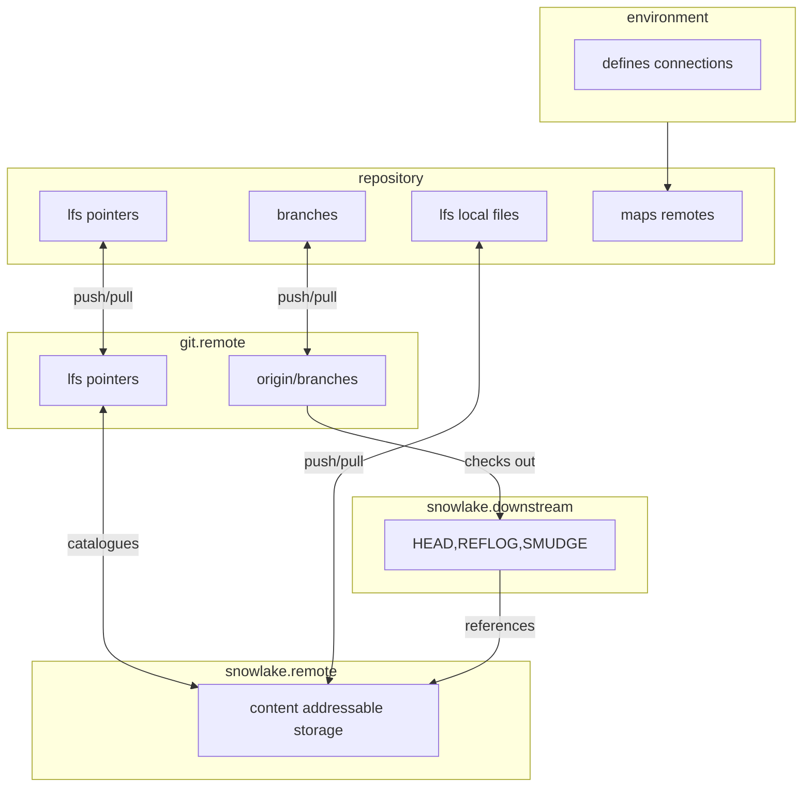

# Snowlake

snowlake implements a [git lfs custom transfer
agent](https://github.com/git-lfs/git-lfs/blob/main/docs/custom-transfers.md) in
order to facilitate the management and versioning of binary files in snowflake
stages.

## Core features

- Utilize a snowflake managed stage as content-addressable-storage and as a
  backend for `git-lfs`
- Manage data lake binary objects like you would a git repository
- Use a snowflake table as a HEAD pointer to create a zero-copy mapping between
  your content addressable storage and a snowflake database
- implemented in pure Python and respects your `config.toml`/`connections.toml`
  file, see
  [here](https://docs.snowflake.com/en/developer-guide/snowflake-cli/connecting/configure-connections)
- quickly set up your git repository to use snowlake

## Dependencies  to install

- git 
- git lfs
- python

## Installation

snowlake is an installable python package, install with your favourite tool,
e.g.

``uv tool install https://github.com/tenk15/snowlake.git``

## Architecture



The mental model in which snowlake thinks about the data is illustrated
(simplified and maybe slightly inaccurate) in the diagram.

## Usage

### Setup

snowlake exposes a small cli ``snowlake``

In order to set up a repository to use snowlake for managing lfs files.

1. Make sure Python is able to find the snowflake database connection you want
   to use. See
   [here](https://docs.snowflake.com/en/developer-guide/snowflake-cli/connecting/configure-connections)
2. setup a ``snowlake.toml`` in the repository root

```toml
schema = "snowlake"
catalog = "catalog"
obj = "obj"
HEAD = "HEAD"
reflog = "REFLOG"

[remote.origin]
snowlake-uri = "snowflake://test_account/origin"
```

- ``schema``: The schema snowlake will create in your database to manage its
  data.
- ``catalog``: The table snowlake will create in ``schema`` to catalogue the
  blobs.
- ``obj``: The stage snowlake will create to store the blobs in .
- ``HEAD``: The table that will conventionally act as the HEAD pointer for you
  lakes.
- ``REFLOG``: The table that will conventionally act as the REFLOG history for
  your lakes.
  
The top-level configuration might be omitted to be set to their default value.
Specifying a remote and uri for the remote mapping is necessary. The remote has
to have the same name as you git remote.

A ``snowlake-uri`` is specified as above where in this case `test_account` is
your database connection as defined in your ``config.toml`` /
``connection.toml``. And ``origin`` is the name of the database snowlake should
deploy to. You need to have read/write access to the database in order to create
the necessary structures.

3. Run `snowlake init` inside your git repository. This will 
   - create the necessary structures in your database if they do not exist
   - run `git lfs install` to configure your repository to use lfs
   - create the necessary config entries to use `snowlake transfer` as a custom
     transfer agent.

If you are cloning a repository that uses snowlake for its lfs storage you need
to clone with ``GIT_LFS_SKIP_SMUDGE`` set, otherwise the clone will fail when
trying to checkout the lfs files, since the client does not know anything about
snowlake without initialization. Run ``snowlake init`` and ``git lfs pull``
afterwards. If the database structures already exist, ``snowlake init`` will
just setup your local config.

### Pushing lfs objects

git lfs uses a pre-push hook to push files to the remote. This means that
pushing lfs files should just work, as long as the configuration is correct and
you have the correct access rights.

If you are migrating to `snowlake` you need to push all refs for which you want
to migrate lfs objects via ``git lfs push origin <ref> --all``

### Pulling lfs objects

Should just work apart from inital clone.

### Managing files on snowlake

``snowlake`` exposes a cli method to manipulate the ``HEAD`` table in a
database. The ``HEAD`` table is a map from the file system representation of the
lfs objects (as they exist in your repository) to the content addressable object
storage.

```snowlake checkout <remote> <ref> <database>```

will manipulate ``HEAD`` such that the objects pointed to by their file paths
match the structure in the given ``ref``. It will check that the commit pointed
to by ``ref`` are in ``remote`` so that (in normal usage) it should be
guaranteed that the reference is actually pointing to an object in the storage.

The command will also append a row to the ``REFLOG``.

If the ``HEAD`` pointer table does not exist, it will be created in
``database``. snowlake will also register a stored procedure ``SMUDGE``, that is
the equivalent to lfs smudge filter.

```python
def smudge(session: Session, head_ref: str, path: str) -> str
```

where `head_ref` is a qualified reference to the ``HEAD`` pointer table, i.e.
``SNOWLAKE.HEAD`` with default configurations and ``path`` is the path you
expect the file to be in in ``ref``.

``SMUDGE`` might be used in snowflake scripting, to more easily reference objects
by their filepath. Sadly, the returned string might not be used in expressions,
as snowflakes ``IDENTIFIER()`` is not usable for objects stored in a stage.
